# 🧠 Cache Memory System

A fully parameterized **4-way set-associative cache** with LRU replacement and write-back policy, implemented in Verilog HDL.

---

## 📋 Project Overview

This project implements a complete memory hierarchy system modeling CPU-to-memory interactions through a high-performance cache subsystem. The design reduces average memory access time by serving frequently accessed data from the cache and only fetching from main memory on cache misses.

**Key Features:**
- 4-way set-associative cache architecture
- LRU (Least Recently Used) replacement policy
- Write-back policy with dirty bit tracking
- Fully parameterized modules for reusability
- Synchronous RAM with configurable depth

---

## 🔧 Technical Specifications

| Parameter | Value |
|-----------|-------|
| Address Width | 16 bits |
| Data Width | 32 bits |
| Cache Type | 4-way Set Associative |
| Cache Entries | 256 total (64 per way) |
| Replacement Policy | LRU (Counter-based) |
| Write Policy | Write-Back |
| Clock | Single-edge synchronous |

### Module Parameters

```verilog
parameter ADDR_WIDTH   = 16;  // Memory address bits
parameter DATA_WIDTH   = 32;  // Data bus width
parameter CE_PER_WAY   = 64;  // Cache entries per way
parameter WAYS         = 4;   // Number of ways
parameter BYTE_OFFSET  = 2;   // Byte offset bits
```

---

## 📁 Repository Structure

```
Caching_System/
├── design.v              # Combined RTL (RAM, Cache, Controller, Top)
├── tb_cache_system.v     # Testbench with stimulus
├── mem.dat               # Memory initialization file
├── run.do                # ModelSim/QuestaSim simulation script
└── README.md             # This file
```

| File | Description |
|------|-------------|
| `design.v` | All synthesizable RTL modules combined |
| `tb_cache_system.v` | Verification testbench with read/write tests |
| `mem.dat` | Hex-formatted initial RAM contents |
| `run.do` | Automated simulation script |

---

## 🏗️ Architecture

```mermaid
flowchart LR
    subgraph CPU["CPU Interface"]
        A[("Address\n16-bit")]
        D[("Data\n32-bit")]
        C[("Control\nreq/wen")]
    end

    subgraph CTRL["Cache Controller"]
        FSM["FSM\n(IDLE→CHECK→ALLOC→WB)"]
        DEC["Address Decoder\nTag | Index | Offset"]
    end

    subgraph CACHE["4-Way Cache"]
        W0["Way 0\n64 entries"]
        W1["Way 1\n64 entries"]
        W2["Way 2\n64 entries"]
        W3["Way 3\n64 entries"]
        LRU["LRU Logic"]
    end

    subgraph MEM["Main Memory"]
        RAM["RAM\n16K × 32-bit"]
    end

    A --> DEC
    D --> FSM
    C --> FSM
    DEC --> FSM
    FSM <--> W0 & W1 & W2 & W3
    FSM <--> LRU
    FSM <--> RAM
```



### Data Flow


---

## 🚀 Simulation Setup

### Prerequisites
- ModelSim / QuestaSim / Icarus Verilog
- GTKWave (optional, for waveform viewing)

### Running with ModelSim

```bash
# Navigate to project directory
cd Caching_System

# Run simulation script
vsim -do run.do
```

### Running with Icarus Verilog

```bash
# Compile
iverilog -o cache_sim design.v tb_cache_system.v

# Run
vvp cache_sim

# View waveforms (if VCD generated)
gtkwave dump.vcd
```

---

## ✅ Test Cases

| Test | Description | Expected Result |
|------|-------------|-----------------|
| 1 | Compulsory miss at 0x1000 | Allocates from RAM |
| 2 | Write 0xAAAAAAAA to 0x1000 | Sets dirty bit |
| 3 | Read back 0x1000 | Returns 0xAAAAAAAA |
| 4 | Thrash set to force eviction | LRU selects victim |
| 5 | Verify write-back to RAM | RAM contains updated data |

---